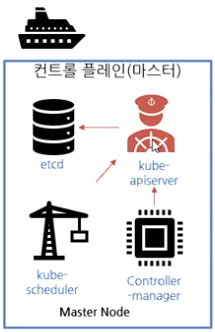
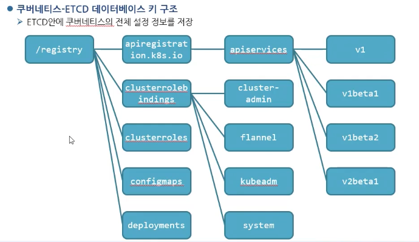

# 도커와 마이크로서비스 이해

왜 많은 기업들이 쿠버네티스를 사용하는가?  

이전에는 모놀리식(Monolithic architecture) 아키텍처를 사용하였으며  

- 전통적인 아키텍처, 기존에 사용하던 서비스 방법
- 서비스가 하나의 애플리케이션으로 돌아가는 구조
- 기존의 개발 방식을 사용해 개발하여 간단히 배포
- 하나의 서비스 또는 어플리케이션이 하나의 거대한 아키텍처
- 다양한 기능을 동작하는 서비스를 서버에서 실행하여 서비스

## 모놀리식 아키텍처의 단점

모놀리식 서비스 (온프라미스) 아키텍처를 스케일링 하면?  
`기존의 애플리케이션을 그대로 복제`하여 로드밸런싱  
`불필요한 서비스까지 모두 복제`  

예시로  

- 이벤트 게시판 페이지
- 회원가입 페이지
- 문의 게시판 페이지

의 3개가 있다면 사용자의 접속량이 많은 이벤트 게시판 만 더 늘리고 싶어합니다.  
하지만 모놀리식 서비스는 한꺼번에 묶여 있기 때문에 불필요한 페이지까지 모두 복사 배포하게 됩니다.  

종속적인 라이브러리의 충돌  
각각의 기능들은 서로 다른 기능을 제공하여 버전의 종속성을 필요한 경우가 존재  
`각 기능의 따른 라이브러리를 매번 업데이트마다 관리하기 매우 어려움`  

조금만 수정해도 전체 빌드 및 배포가 필요하다.  
소스코드 `전체가 하나`로써 동작하기 때문에 `작은 수정만 있더라도 전체를 빌드하여 다시 배포`해야 합니다.  
`프로그램의 크기가 어느정도 커지면` 한 번만 컴파일해서 전체 테스트를 돌려도 30분 내지 수 시간 소모된다.

## 마이크로서비스 아키텍처

모놀리식 아키텍처의 대안으로 반대되는 개념  
애플리케이션의 각각의 기능을 분리하여 개발 및 관리  
마이크로서비스 장점  
1. 서비스 단위 빠른 개발: `개발자가 특정 비즈니스 로직에 대해서만 집중하여 개발 가능`
2. `배포 용이`: 개별 서비스 단위로 개발, 패키징, 빌드, 테스트, 배포로 `각 서비스마다 유연한 스케줄`
3. 서비스 단위 고효율 저비용 Scale-Out 구조: 서비스 단위로 스케일링이 가능하여 `불필요한 서비스는 줄이고` 더 많은
자원이 필요한 서비스는 확장가능  
단점으로는 분산 시스템 환경에서 Transaction 보장, 테스트, 배포, 관리 복잡

## 컨테이너가 해결한다!

컨테이너는 가상머신을 사용해 각 마이크로 서비스를 격리하는 기술   
컨테이너는 가상머신처럼 하드웨어를 전부 구현하지 않기 때문에 매우 빠른 실행이 가능  
프로세스의 문제가 발생할 경우 컨테이너 전체를 조정해야 하기 때문에 컨테이너에 하나의 프로세스를 실행하도록 하는 것이 좋다

컨테이너를 격리하는 기술  
리눅스 네임 스페이스: 각 프로세스가 파일 시스템 마운트, 네트워크, 유저(uid), 호스트 네임(uts) 등 에 
대해 `시스템에 독립 뷰를 제공`

- 프로세스 1
  - 파일
  - 네트워크
- 프로세스 2
  - 파일
  - 네트워크

둘의 프로세스는 간섭할 수 없습니다.

컨테이너를 격리하는 기술  
리눅스 컨트롤 그룹: 프로세스로 소비할 수 있는 
리소스 양(CPU, 메모리, I/O, 네트워크 대역대, device 노드 등) 을 제한

## 도커 (Docker)

컨테이너 기술을 지원하는 다양한 프로젝트 중에 하나  
컨테이너 기술이 이전에도 있었으나 도커로 인해 알려짐  
컨테이너 기술의 사실상 표준  
2014년 가장 인기 있는 클라우드 오픈 소스 2위 (리눅스 재단 발표)  
다양한 운영체제에서 사용 가능 (리눅스, 윈도우, MacOS)  
애플리케이션에 국한 되지 않고 의존성 및 파일 시스템까지 패키징하여 빌드, 배포, 실행을 단순화  
리눅스의 네임 스페이스와 cgroups와 같은 커널 기능을 사용하여 가상화 

도커는 다양한 클라우드 서비스 모델과 같이 사용이 가능합니다.  
컨테이너: `이미지를 격리하여 독립된 공간에서 실행한 가상 환경`  
이미지: 필요한 프로그램과 라이브러리, 소스를 설치한 뒤 만든 하나의 파일  

도커 아키텍쳐  
Docker engine: 이미지, 네트워크, 디스크 등의 관리 역할  
Containerd: OCI 구현체(주로 runC)를 이용해 container 를 관리해주는 daemon  
두 프로그램이 각각 돌아가기 때문에 `Docker Engine 을 재시작해도 각 이미지에 영향이 없음`  

- Docker Engine
  - containerd
    - containerd-shim
      - runC
    - containerd-shim
      - runC

도커의 한계  
`서비스가 커지면 커질 수록 관리해야 하는 컨테이너의 양이 급격히 증가`  
도커를 사용하여 관리를 한다 하더라도 쉽지 않은 형태

쿠버네티스  
2014년 구글이 오픈 소스 공개  
구글이 컨테이너 운영 노하우가 담긴 오픈소스  
다수의 컨테이너를 자동으로 운영하기 위한 오케스트레이션 도구  
많은 시스템을 통합, 컨테이너를 다루기 위한 API 제공  

데브옵스 모델  
데브옵스는 `소프트웨어 개발과 IT 운영을 결합한 합성어`  
기존의 분리된 `소프트웨어 개발팀과 IT 운영팀의 협업으로 전체 라이프사이클을 함께 관리`할 수 있자는 일종의 철학 또는 운동  
소프트웨어 개발팀과 IT 팀이 더 빠르고 안정적으로 소프트웨어를 빌드, 릴리즈할 수 있도록 두 팀 간의 프로세스를 자동화하는 일련의 과정  

데브옵스의 장점  
- 속도: 서로의 업무에 대해 더 잘 이해하여 좀더 신속하게 사용자에게 필요한 업데이트를 수행 가능. 개발자는 소비자가 무엇을 원하는지, 운영자는 애플리케이션을 제공하는데 해결할 문제를 인지할 수 있음
- 신속한 제공: 컨테이너와 마이크로서비스를 사용하면 더 자주 빠르게 릴리즈하는 것이 가능. 더 빠르게 좋은 기능을 제공할 수 있으며 개발자가 운영에 필요한 인프라와 하드웨어에 대해 잘 몰라도 릴리즈 가능.
- 개발과 릴리즈가 편해지므로 안정성이 확보, 현업 강화

개발자와 시스템 관리자의 역할 분담  
개발자의 관점  
- `새로운 기능을 만들어 사용자 경험을 개선하는 것을 좋아함`
- 기본 운영체제의 보안 패치나 이와 관련된 모든 것이 최신인지 확인하는 것을 시스템 관리자에게 맡기려 함

시스템 관리자의 관점
- 제품 배포와 운영하는 하드웨어 인프라를 담당하며 시스템 보안, 활용, `개발자의 우선순위가 높지 않은 측면에 신경을 씀`
- 운영 담당자는 모든 애플리케이션 구성 요소의 암묵적 상호 의존성에 대처하기를 원하지 않음
- 기본 운영체제나 인프라를 변경했을 때 애플리케이션 전체 동작에 어떤 영향을 미칠지는 생각치 못함

노옵스 (noops)  
하드웨어 인프라를 이해하지 않아도 개발자가 직접 애플리케이션을 배포 가능  
물론 하드웨어 인프라를 관리할 사람은 필요  
그러나 실행 중인 애플리케이션의 특성을 꼭 알 필요는 없음  

- 개발자
  - 애플리케이션을 배포하고 실행하는 단일 플랫폼으로써 실제 하드웨어를 추상화하고 노출하므로 새발자는 시스템 관리자의 도움 없이도 애플리케이션을 구성하고 배포할 수 있다.
- 시스템 관리자
  - 실제로 하드웨어에서 실행되고 있는 애플리케이션에 대해 모르더라도 기본 인프라를 유지하고 가동하는데 집중할 수 있다.

# Vagrant 명령어로 가상환경 구축하기

vagrant up 명령어 실행

192.168.1.10  
username: root  
password: vagrant  

# 도커 명령어

관리자 권환으로 변경하기  
sudo -i  

도커 명령어로 검색  
> docker search tomcat

도커 이미지만 다운로드
> docker pull {name}

도커 켄테이너 이미지 생성
> docker create -p 80:80 --name nx nginx

도커 컨테이너 이미지 시작
> docker start {이미지 ID & 이미지 name}

도커 컨테이너 생성 & 시작
> docker run -d -p 8080:8080 --name tc consol/tomcat-7.0
> -d : 백그라운드 환경에서 가동
> --name : 컨테이너의 이름 부여

도커 이미지 목록 확인
> docker images

도커 이미지 삭제
> docker rmi {name}

실행중인 컨테이너 확인
> docker ps

실행중인 모든 컨테이너 확인
> docker ps -a

컨테이너 중지/삭제
> docker stop {이미지 ID & 이미지 name}
> docker rm {이미지 ID & 이미지 name}

# 레이어의 개념

도커 이미지 정보 확인
> docker inspect nginx

도커 이미지 저장소 위치 확인
> docker info
> cd /var/lib/docker/overlay2

도커 히스토리 확인
> docker history {name}

# 도커의 유용한 명령어

포트포워딩으로 톰캣 실행하기
> docker run -d --name tc -p 80:8080 tomcat firefox 127.0.0.1:80

컨테이너 내부 셸 실행
> docker exec -it tc /bin/bash

컨테이너 로그 확인
> docker logs tc

호스트 및 컨테이너 간 파일 복사  
현재 로컬시스템에서 다른 컨테이너로 이동 가능
> docker cp {path} {to container}:{path}

컨테이너에서 현재 로컬시스템으로 이동 가능
> docker cp {from container}:{path} {path}

컨테이너 안에서 컨테이너 로 가는것도 가능
> docker cp {from container}:{path} {to container}:{path}

임시 컨테이너 생성
> docker run -d -p 80:8080 --rm --name tc {name}

도커 PS ID 만 출력
> docker ps -a -q

도커 이미지 모두 중지
> docker stop `docker ps -a -q`
> docker rm `docker ps -a -q`

# MySQL 서비스 구축해보기

https://hub.docker.com/_/mysql

환경 변수 사용해 데이터 전달하기
> docker run -d --name nx -e env_name=test1234 nginx
> printenv

> docker run --name some-mysql -e MYSQL_ROOT_PASSWORD='test1234' -d mysql
> docker exec -it ms mysql -u root -p

# 볼륨 마운트하여 Jupyter LAB 서비스 구축

https://hub.docker.com/r/jupyter/datascience-notebook  

볼륨 마운트 옵션 사용해 로컬 파일 공유하기  
> docker run -v {호스트 경로}:{컨테이너 내 경로}:{권한}

- 권한 종류
  - ro : 읽기 전용
  - rw : 읽기 및 쓰기

Nginx 로 볼륨 마운트하기 예제  

~~~
docker run -d -p 80:80 --rm --name nx -v /var/www:/usr/share/nginx/html:ro nginx
~~~

# 도커 이미지 푸시

도커 이미지 태그 변경 후 푸시

~~~
docker login
docker tag {name} {DockerHubId/name}:{version}
ex) docker tag test {jjunpro/test}
docker images
docker push {DockerHubId/name}:{version}
~~~

도커 이미지 히스토리 확인  
> docker history {DockerHubId/name}:{version}

# 프라이베이트 레지스트리 구현 및 사용

private registry 만들기
> docker run -d --name docker-registry -p 5000:5000 registry

프라이베이트 레지스트리에 이미지 푸시하기
> docker tag {name} {ip}:{port}/{name}
> docker push {ip}:{port}/{name}

# 쿠버네티스 소개

- 인프라의 추상화
  - 컨테이너 시스템에서 컨테이너 애플리케이션을 쉽게 배포, 관리하도록 돕는 소프트웨어 시스템
  - 기본 인프라 추상화해 개발 및 운영 팀의 개발, 배포, 관리를 단순화
  - 모든 노드가 하나의 거대한 컴퓨터인 것처럼 수천개의 컴퓨터 노드에서 소프트웨어 애플리케이션을 실행

# 쿠버네티스 소개

쿠버네티스 클러스터 아키텍처  
쿠버네티스의 클러스터는 하드웨어 수준에서 많은 노드로 구성되며 두 가지 유형으로 나뉨  

- 마스터 노드 : 전체 쿠버네티스 시스템을 관리하고 통제하는 쿠버네티스 컨트롤 플레인을 관장
- 워커 노드 : 실제 배포하고자 하는 애플리케이션의 실행을 담당

- 마스터 노드 (컨트롤 플레인)
  - kube-apiserver
    - 사용자, 컨트롤 플레인과 통신
  - etcd
    - 클러스터 구성을 지속적으로 저장하는 안정적인 분산
  - kube-scheduler
    - 어떤 노드에 무엇을 배치할지 전략을 짜는 역할
  - Controller-manager
    - 리소스를 관리하고 제어하는 역할
- 워커 노드
  - kubelet
    - 컨테이너 런타임
  - kube-proxy
    - 컨테이너들 간의 통신 혹은 노드들간의 통신을 담당

컨트롤 플레인 (마스터 노드)  
컨트롤 플레인에서는 클러스터를 관리하는 기능  
단일 마스터 노드에서 실행하거나 여러 노드로 분할되고 복제돼 고가용성을 보장  
클러스터의 상태를 유지하고 제어하지만 애플리케이션을 실행하지 않음  

워커 노드  
워커 노드는 컨테이너화 된 애플리케이션을 실행하는 시스템  
애플리케이션에 서비스를 실행, 모니터링, 제공하는 작업은 다음과 같은 구성요소로 수행  
컨테이너 런타임: 컨테이너를 실행하는 도커  
Kubelet: API 서버와 통신하고 노드에서 컨테이너를 관리  
쿠버네티스 서비스, 프록시: 애플리케이션 간에 네트워크 트래픽을 분산 및 연결

# 쿠버네티스 명령어

모든 포드와 관련된 서비스 초기화 삭제
> kubectl delete all --all

pods 스케일링
> kubectl scale deployment {이름} --replicas=3

이미지 만들기
> kubectl create deploy {서브이름} --image={이름}

외부 노출하기
> kubectl expose deploy {서브이름} --type=NodePort --port=80 --target-port=80

전체 조회 명령어
> kubectl get all

조회 명령어
> kubectl get deploy,pod,svc

조회 명령어 pod 상세보기
> kubectl get pods -o wide

pod 삭제 & 모두삭제
> kubectl delete pod
> kubectl delete pod --all

쿠버네티스에 연결된 노드 확인
> kubectl get nodes

쿠버네티스 파일 실행
> kubectl create -f {파일이름}

쿠버네티스 파일 실행 - 로그기록
> kubectl create -f {파일이름} --record=true

쿠버네티스 pod 진행상황 상세보기
> kubectl describe pod {pod 이름}

yaml 파일로 포드 디스크립터 생성
> kubectl create -f go-http-pod.yaml

yaml 파일로 포드 디스크립터 삭제
> kubectl delete -f go-http-pod.yaml

로그 확인
> kubectl logs http-go

변수 넣어주기
> kubectl annotate pod {pod 이름} {key}={value}

레플리케이션 확인하기
> kubectl get rc

레플리케이션 스케일링
> kubectl scale rc {이름} --replicas=5

레플리케이션 수정
> kubectl edit rc {이름}

레플리케이션 파일로 수정
> kubectl apply -f {파일이름}

레플리카셋 조회
> kubectl get rs

레플리카셋 조회
> kubectl describe rs {name}

레플리카셋 조회
> kubectl delete rs {name}

# Kubernetes 구조

Kubernetes는 컨테이너화된 애플리케이션을 자동으로 배포, 스케일링 및 관리해주는 시스템입니다.  

## 클러스터

Kubernetes 환경에서 가장 큰 구조는 Cluster입니다.  
쿠버네티스 백서에서는 Cluster를 아래와 같이 정의하고 있습니다.

`클러스터란 컨테이너화된 애플리케이션을 실행하는 노드라고 하는 워커 머신의 집합. 모든 클러스터는 최소 한 개의 워커 노드를 가진다.`

Kubernetes는 `Master Node(Control Plane)` 와 `Worker Node` 로 이루어져 있으며, 각 노드 내부의 다양한 `Component를 통해 동작`합니다.

Kubernetes Cluster는 `api-server, etcd, scheduler, controller` 등의 
컴포넌트가 설치된 `Master Node(Controle Plane)와, kubelet과 kube-proxy,` 컨테이너 런타임이 설치된 `Worker Node` 로 구성됩니다.

거기에 추가적으로 `Master Node의 api-server와 통신하며 Cluster`에 명령을 내릴 서버가 구성되어야 하는데, 
`Master Node` 내부에 구성할 수도 있고 로컬 PC에 구성할 수도 있습니다.

## 호스트 컴퓨터(로컬 PC)

Kubernetes 관리자는 kubectl을 이용해서 Kubernetes Cluster 에 명령을 내릴 수 있습니다.  
kubectl은 KUBECONFIG 환경변수를 참조해 명령을 내릴 클러스터의 정보를 인식합니다.  
KUBECONFIG 환경변수가 정의되어 있지 않다면 $HOME/.kube/config 파일을 참고합니다.  

Master Node는 단일로 구성할 수 있지만 백업을 위해 여러대의 서버를 Master Node로 구성할 수 있으며, 다중 구성 시 항상 홀수개로 구성되어야 합니다.

## Master Node

Master Node의 핵심 컴포넌트는 api-server, etcd, Scheduler, Controller로 구성되어 있습니다.  
구성도상에 있는 Cloud Controller는 AWS, Azure, GCP와 같은 Public Cloud의 서버, 스토리지, 로드밸런서 등의 자원을 Kubernetes가 사용할 수 있도록 돕습니다.  

Kubernetes 선언적인(declarative) 구조를 가지고 있습니다.  
각 요소가 추구하는 상태(desired status)를 선언하면 현재 상태(current status)와 비교하여 맞는지 점검하고, 추구하는 상태에 맞추려고 노력하는 방식으로 설계되어 있습니다.  

이렇게 api-server를 통해 선언한 추구하는 상태값들을 저장하는 장소가 etcd입니다.  

- api-server
  - Kubernetes 클러스터의 중심 역할을 하는 통로
  - Kubernetes api를 사용하도록 요청을 받고 요청이 유효한지 검사
  - kubectl이 설치된 로컬 머신에서 kubectl 명령어 수행시 문법, 권한 검사
  - api-server와 etcd는 거의 한 몸으로 움직이게 설계됨
- etcd
  - key-value 타입 저장소
  - 구성 요소들의 상태 값이 모두 저장되는 곳
  - etcd 외에 다른 구성 요소들은 상태값을 관리하지 않으므로 etcd를 잘 백업해두면 장애가 발생해도 etcd를 통해 쿠버네티스 클러스터 복구 가능
  - 분산 저장이 가능함, 복제해 여러 곳에 두면 하나의 etcd가 장애가 나도 시스템 가용성 확보
- Scheduler
  - Pod를 실행할 노드 선택
- Controller
  - Pod를 관찰하여 선언한 개수를 보장
  - Addon Component
  - Container Runtime(Docker, Containerd, Rocket 등)
  - Core DNS
  - CNI
  - Dashboard
  - ELK, EFK, Datadog 등 로깅 컴포넌트

## Worker Node

Worker Node 는 실제 컨테이너들이 배포되는 서버들입니다.  
관리자는 Pod를 배포할 때 어떤 Worker Node에 Pod를 배포할지 선택할 수도 있지만,  
일반적으로는 scheduler에 의해 배포 대상 Worker Node가 선택됩니다.  

워커노드의 핵심 컴포넌트들은 kubelet, kube-proxy, Container runtime(Docke 등)이 있습니다.

- kubelet
  - 모든 노드에서 실행되는 Kubernetes 에이전트
  - 데몬 형태로 동작
  - c-Advisor 모니터링 툴이 들어있음
  - 워커노드에서 동작중인 kubelet이 정지되면 Container runtime에 요청을 보내는 역할을 수행해주는 컴포넌트가 정지되었으므로 Pod 생성, 삭제 등이 해당 노드에서 정상적으로 수행되지 않음
- kube-proxy
  - Kubernetes의 network 동작을 관리
  - iptables rule을 구성
  - kube-proxy 서비스가 중단된 경우 네트워킹이 제대로 이루어지지 않음
  - Cluster IP를 통해 WEB 등 서비스 요청시 오류 발생
  - Container runtime
- 컨테이너를 실행하는 엔진
  - docker, containerd, runc 등
  - profile

[출처] https://velog.io/@squarebird/Kubernetes-Kubernetes-%EA%B5%AC%EC%A1%B0

# 쿠버네티스

우분투 vm VirtualBox 18 버전 접속 후

> apt install vim -y
> apt update && apt install docker.io -y

쿠버네티스 설치  

https://kubernetes.io/ko/docs/setup/production-environment/tools/kubeadm/install-kubeadm/

apt 패키지 색인을 업데이트하고, 쿠버네티스 apt 리포지터리를 사용하는 데 필요한 패키지를 설치한다.
~~~
sudo apt-get update
sudo apt-get install -y apt-transport-https ca-certificates curl
~~~

구글 클라우드의 공개 사이닝 키를 다운로드 한다.
~~~
sudo curl -fsSLo /usr/share/keyrings/kubernetes-archive-keyring.gpg https://packages.cloud.google.com/apt/doc/apt-key.gpg
~~~

쿠버네티스 apt 리포지터리를 추가한다.
~~~
echo "deb [signed-by=/usr/share/keyrings/kubernetes-archive-keyring.gpg] https://apt.kubernetes.io/ kubernetes-xenial main" | sudo tee /etc/apt/sources.list.d/kubernetes.list
~~~

apt 패키지 색인을 업데이트하고, kubelet, kubeadm, kubectl을 설치하고 해당 버전을 고정한다.
~~~
sudo apt-get update
sudo apt-get install -y kubelet kubeadm kubectl
sudo apt-mark hold kubelet kubeadm kubectl
~~~

설치 완료 후 스왑의 비활성화가 필요합니다.

리부팅 후 다시 설정이 초기화됩니다.
> swapoff -a

영구적으로 적용되는 설정
> sudo sed -i '/ swap / s/^\(.*\)$/#\1/g' /etc/fstab

docker info | grep -i group    
cgroup 정보를 변경합니다.

> /etc/docker/daemon.json
~~~
  { "exec-opts": ["native.cgroupdriver=systemd"] }
~~~
systemctl restart docker 혹은 service docker restart

# 클러스터 구성 및 쿠버네티스 테스트

> kubeadm init --token 123456.1234567890123456 --token-ttl 0 \
--pod-network-cidr=172.16.0.0/16 --apiserver-advertise-address=192.168.1.10

마스터 노드에서만 실행을 합니다.  
마스터 노드에 필요한 기능을 세팅하는 작업을 합니다.  

완료 후 regular user 등록을 시도합니다.

> kubeadm reset

이것은 초기화명령어

~~~
mkdir -p $HOME/.kube
sudo cp -i /etc/kubernetes/admin.conf $HOME/.kube/config
sudo chown $(id -u):$(id -g) $HOME/.kube/config
~~~

다음은 pod network 구성하는 방법

~~~
export KUBECONFIG=/etc/kubernetes/admin.conf
~~~

워커노드를 join 하는방법  
아래 코드를 워커 노드에서 실행을 합니다.

~~~
kubeadm join 192.168.1.10:6443 --token 123456.1234567890123456 \
    --discovery-token-ca-cert-hash sha256:56d717561ad4b256c9c39c6fd05ab0d34c4f4190924afca6e089b0c7eb23d2d8 
~~~

새로운 토큰을 발행하려면 아래 명령어를 실행하라
> kubeadm token create --print-join-command

토큰 목록 확인
> kubeadm token list

토큰 Hash 값 확인
> openssl x509 -pubkey -in /etc/kubernetes/pki/ca.crt | openssl rsa -pubin -outform der 2>/dev/null | openssl dgst -sha256 -hex | sed 's/^.* //'

워크 노드에 추가 후 [kubectl get nodes] 명령어를 실행하면  
STATUS 가 모두 준비되어 있지 않음을 확인할 수 있습니다.  
이는 [podnetwork] 를 준비하지 않아서 그렇다.

잘 공유되는지 확인해보자

~~~
kubectl create deploy nx --image=nginx
kubectl get pod -w
~~~

웹으로 노출 시키기

~~~
kubectl expose deploy nx --type=NodePort --port=80 --target-port=80
kubectl get svc
curl 127.0.0.1:30794
~~~

스케일링 조절하기

> kubectl scale deploy nx --replicas=5

# 쿠버네티스에서 실행 가능한 컨테이너 작성

마스터 노드에 파일 생성

main.go
~~~
package main

import (
    "fmt"
    "github.com/julienschmidt/httprouter"
    "net/http"
    "log"
    "os"
)

func Index(w http.ResponseWriter, r *http.Request, _ httprouter.Params) {
    hostname, err := os.Hostname()
    if err == nil {
        fmt.Fprint(w, "Welcome! " + hostname +"\n")
    } else {
        fmt.Fprint(w, "Welcome! ERROR\n")
    }
}

func main() {
    router := httprouter.New()
    router.GET("/", Index)

    log.Fatal(http.ListenAndServe(":8080", router))
}
~~~

~~~
yum install golang
go env -w GO111MODULE=auto
go get github.com/julienschmidt/httprouter
go build main.go
mkdir http_go
mv main ./http_go/
cd http_go
vim dockerfile
~~~

~~~
# 아래 3줄 코드는 빌드할때 실행이 됩니다.
FROM golang:1.11
WORKDIR /usr/src/app
COPY main /usr/src/app

# 실제 컨테이너가 실행될 때 실행
CMD ["/usr/src/app/main"]
~             
~~~

~~~
# 도커 파일 만들고 hub 에 배포하기
docker build -t http-go .
docker run -d -p 8080:8080 --rm http-go
docker tag http-go jjunpro/http-go
docker login
docker push jjunpro/http-go

# 아래 명령어로 쿠버네티스 배포가 가능합니다.
kubectl create deploy http-go --image=jjunpro/http-go
~~~

## 포드 (pod) 란?

쿠버네티스는 kubectl get container 와 같이 컨테이너를 취급하지 않는다.  
대신 여러 위치에 배치된 컨테이너 개념인 컨테이너 그룹을 포드(Pod) 라는 개념을 사용  

포드의 특징  
포드는 하나 이상의 밀접하게 관련된 컨테이너로 구성된 그룹  
동일한 리눅스 네임스페이스와 동일한 워커 노드에서 항상 함께 실행  
각 포드는 애플리케이션을 실행하는 자체 `IP, 호스트 이름, 프로세스 등이 있는 별도의 논리적 시스템`  

~~~
# 조회하기
kubectl get deploy,rs,pod
~~~

`deploy 가 필요한 이유는 업데이트 관리`를 합니다.  
일종의 설정,정보 파일이라고 보면 됩니다.  

`rs 는 포드의 개수를 유지하는 역할`을 합니다.  

`pod 컨테이너의 그룹`  

# 디플로이먼트, 포드, 서비스가 동작하는 방식 이해

실제로 포드도 직접 만들지 않음  
kubectl create deploy 명령을 실행하면 디플로이먼트가 생성  
디플로이먼트가 실제 포드 객체를 생성  
해당 디플로이먼트가 관리하는 포드의 포트 8080을 노출하라고 명령 필요  

1. 디플로이먼트 : http-go (Replicas: 1) 이를 rs 라고 지칭 rs 가 포드를 만듭니다.
2. 포드 : http-go-xxxx ip: 10.0.0.1 -> 컨테이너 포드의 IP 는 언제든지 변경할 수 있음
3. 이렇게 안쪽에서 구성된 컨테이너를 외부로 노출시켜야 합니다. 
4. 그리하여 `서비스 라는 객체를 활용`합니다. expose 
5. 서비스 : http-go 내부 ip : 10.1.1.1 바뀌지않음

서비스의 역할  
포드는 일시적이므로 언제든지 사라질 가능성 존재  
`포드가 다시 시작되는 경우에는 언제든 IP 와 ID 변경됨`   
`서비스는 변화하는 포드 IP 주소의 문제를 해결`하고 단일 IP 및 포트 쌍에서 여러 개의 포드 노출  
서비스가 생성되면 정적 IP를 얻게 되고 서비스의 수명 내에서는 변하지 않음  
클라이언트는 포드에 직접 연결하는 대신 IP 주소를 통해 서비스에 연결  
서비스는 포드 중 하나로 연결을 포워딩  
`포드가 만약 고장이 나면 고치지 않고 새로 하나 만들어 빈틈없이 서비스가 돌아가도록 합니다.`

~~~
kubectl expose deployment http-go --type=NodePort --port=80 --target-port=8080
kubectl expose deployment http-go --type=LoadBalancer --port=80 --target-port=8080

kubectl scale deployment http-go --replicas=3
kubectl get svc,pods
~~~

만약 서비스를 삭제하려면 ? 

> kubectl delete svc {서비스 이름}

# POD

YAML 로 포드 디스크립터 만들기  
kubectl 실행 명령으로 간단한 리소스 작성 방법도 가능하지만 일부 항목에 대해서만 가능하며 저장이 용의하지 않음  
모든 쿠버네티스 객체를 YAML 로 정의하면 버전 제어 시스템에 저장 가능  
모든 API 에 대한 내용은 http://kubernetes.io/docs/reference/

포드의 정의  

- 포드 정의 구성 요소
  - apiVersion: 쿠버네티스 api 의 저번을 가리킴
  - kind: 어떤 리소스 유형인지 결정 (포드 레플리카컨트롤러, 서비스 등)
  - 메타데이터: 포드와 관련된 이름, 네임스페이스, 라벨, 그 밖의 정보 존재
  - 스펙: 컨테이너, 볼륨 등의 정보
  - 상태: 포드의 상태, 각 컨테이너의 설명 및 상태, 포드 내부의 IP 및 그 밖의 기본 정보 등
  
~~~
cat << EOF > /root/go-http-pod.yaml

apiVersion: v1
kind: Pod
metadata:
  name: http-go
spec:
  containers:
  - name: http-go
    image: jjunpro/http-go
    ports:
    - containerPort: 8080
    
EOF
~~~

> kubectl create -f go-http-pod.yaml

삭제는 

> kubectl delete -f go-http-pod.yaml

# 라이브니스, 레디네스 프로브 구성

- Liveness, Readiness and Startup Probes
  - Liveness Probe
    - 컨테이너 살았는지 판단하고 다시 시작하는 기능
    - `컨테이너의 상태를 스스로 판단하여 교착 상태에 빠진 컨테이너를 재시작` 
    - 버그가 생겨도 높은 가용성을 보임
  - Readiness Prove
    - 포드가 준비된 상태에 있는지 확인하고 정상 서비스를 시작하는 기능
    - `포드가 적절하게 준비되지 않은 경우 로드밸런싱을 하지 않음`
  - Startup Probes
    - 애플리케이션의 시작 시기 확인하여 가용성을 높이는 기능
    - Liveness 와 Readiness 의 기능을 비활성화

## 라이브니스, 레디네스, 프로브 구성

https://kubernetes.io/docs/tasks/configure-pod-container/configure-liveness-readiness-startup-probes/

### Liveness 커맨드 설정 - 파일 존재 여부 확인

~~~
apiVersion: v1
kind: Pod
metadata:
  labels:
    test: liveness
  name: liveness-exec
spec:
  containers:
  - name: liveness
    image: registry.k8s.io/busybox
    args:
    - /bin/sh
    - -c
    - touch /tmp/healthy; sleep 30; rm -f /tmp/healthy; sleep 600
    livenessProbe:
      exec:
        command:
        - cat
        - /tmp/healthy
      initialDelaySeconds: 5
      periodSeconds: 5
~~~

liveness-exec 라는 컨테이너 생성  
[ touch /tmp/healthy; sleep 30; rm -f /tmp/healthy; sleep 600 ]
파일 생성 후 30 초 후 파일을 삭제  
[ livenessProbe ] pod 가 살아있는지 계속 정검해주는 역할을 합니다.  
exec 실행해라 command 커멘드를 

### Liveness 웹 설정 - Http 요청 확인

서버 응답 코드가 200이상 400미만 컨테이너 유지 그외는 재시작

~~~
apiVersion: v1
kind: Pod
metadata:
  labels:
    test: liveness
  name: liveness-http
spec:
  containers:
  - name: liveness
    image: registry.k8s.io/liveness
    args:
    - /server
    livenessProbe:
      httpGet:
        path: /healthz
        port: 8080
        httpHeaders:
        - name: Custom-Header
          value: Awesome
      initialDelaySeconds: 3
      periodSeconds: 3
~~~

### 라이브니스, 레디네스 프로브 구성

- Readiness TCP 설정
  - 준비 프로브는 8080 포트를 검사
  - 5초 후부터 검사 시작
  - 검사 주기는 10초
  - 서비스를 시작해도 된다.
- Liveness TCP 설정
  - 활성화 프로브는 8080 포트를 검사
  - 15초 후 부터 검사 시작
  - 검사 주기는 20초
  - 컨테이너를 재시작하지 않아도 된다.

~~~
apiVersion: v1
kind: Pod
metadata:
  name: liveness-exec
  labels:
    app: goproxy
spec:
  containers:
  - name: goproxy
    image: registry.k8s.io/goproxy:0.1
    ports:
    - containerPort: 8080
    readinessProbe:
      tcpSocket:
        port: 8080
      initialDelaySeconds: 5
      periodSeconds: 10
    livenessProbe:
      tcpSocket:
        port: 8080
      initialDelaySeconds: 15
      periodSeconds: 20
~~~

[ initialDelaySeconds ] 몇 초 후부터 [ periodSeconds ] 몇 초 간격으로 검사한다.  

### 라이브니스, 레디네스 프로브 구성

- Statup Probe
  - `시작할 때까지 검사를 수행`
  - http 요청을 통해 검사
  - 30번을 검사하며 10초 간격으로 수행
  - 300(30*10) 초 후에도 포드가 정상 동작하지 않는 경우 종료
  - 300초 동안 포드가 정상 실행되는 시간을 벌어줌

~~~
ports:
- name: liveness-port
  containerPort: 8080
  hostPort: 8080

livenessProbe:
  httpGet:
    path: /healthz
    port: liveness-port
  failureThreshold: 1
  periodSeconds: 10

startupProbe:
  httpGet:
    path: /healthz
    port: liveness-port
  failureThreshold: 30
  periodSeconds: 10
~~~

[ startupProbe ] 가 실행되고 있는 경우에는 [ livenessProbe ] 가 실행되지 않고 있는 환경  
[ periodSeconds ] 몇 초간 [ failureThreshold ] 몇 번 검사

# 레이블과 셀렉터

- 레이블이란?
  - 모든 리소스를 구성하는 매우 간단하면서도 강력한 쿠버네티스 기능
  - 리소스에 처부하는 임의의 키/값 쌍 (예 app:test)
  - 레이블 셀렉터를 사용하면 각종 리소스를 필터링하여 선택할 수 있음
  - 리소스는 한 개 이상의 레이블을 가질 수 있음
  - 리소스를 만드는 시점에 레이블을 첨부
  - 기존 리소스에도 레이블의 값을 수정 및 추가 가능
  - 모든 사람이 쉽게 이해할 수 있는 체계적인 시스템을 구축 가능
    - app: 애플리케이션 구성 요소, 마이크로서비스 유형 지정
    - rel:  애플리케이션의 버전 지정

- 새로운 레이블을 추가할 때는 label 명령어를 사용
  - kubectl label pod http-go-v2 test=foo
- 기존의 레이블을 수정할 때는 --overwirte 옵션을 주어서 실행
  - kubectl label pod http-go-v2 rel=beta
    - error
  - kubectl label pod http-go-v2 rel=beta --overwrite
    - success
- 레이블 삭제
  - kubectl label pod http-go-v2 rel-
- 레이블 보여주기
  - kubectl get pod --show-labels
- 특정 레이블 컬럼으로 확인
  - kubectl get pod -L app,rel

## 레이블로 필터링하여 검색

> kubectl get pod --show-labels -l 'env'
> kubectl get pod --show-labels -l '!env'
> kubectl get pod --show-labels -l 'env!=test'
> kubectl get pod --show-labels -l 'env!=test,rel=beta'

간단 예제

~~~
apiVersion: v1
kind: Pod
metadata:
  name: http-go
  labels:
        creation_method: manual
        env: prod
spec:
  containers:
  - name: http-go
    image: jjunpro/http-go
    ports:
    - containerPort: 80
      protocol: TCP
~~~

> kubectl get pod --show-labels

# 레플리케이션 컨트롤러

포드가 항상 실행되도록 유지하는 쿠버네티스 리소스  
노드가 클러스터에서 사라지는 경우 해당 포드를 감지하고 대체 포드 생성  
실행 중인 포드의 목록을 지속적으로 모니터링으로 하고 '유형'의 실제 포드 수가 원하는 수와 항상 일치하는지 확인

레플리케이션 : 데이터 저장과 백업하는 방법과 관련이 있는 데이터를 호스트 컴퓨터에서 다른 컴퓨터로 복사하는 것

레플리케이션컨트롤러의 장점  
포드가 없는 경우 새 포드를 항상 실행  
노드에 장애 발생 시 다른 노드에 복제본 생성  
수동, 자동으로 수평 스케일링

~~~
apiVersion: v1
kind: ReplicationController
metadata:
  name: nginx
spec:
  replicas: 3
  selector:
    app: nginx
  template:
    metadata:
      name: nginx
      labels:
        app: nginx
    spec:
      containers:
      - name: nginx
        image: nginx
        ports:
        - containerPort: 80
~~~

> kubectl get rc

# 레플리카셋과 디플로이먼트 란?

쿠버네티스는 어떻게 Pod의 개수를 보장할까?  
Kubernetes 시리즈의 글을 처음 작성할 때, Kubernetes에 대해서  
`"컨테이너화된 애플리케이션을 자동으로 배포, 스케일링 및 관리해주는 시스템"`  
이라고 정의했습니다.  

그럼 Kubernetes는 어떻게 배포할 Container를 선택하고, 갯수를 선택하고 Deploy와 Scaling까지 관리해 주는걸까요?

## Controller

Kubernetes 구조글을 보면 Kubernetes는 여러 컴포넌트들의 상호작용을 통해 동작합니다.  
그 중에서도 Cluster의 Pod들을 관찰하여 관리자가 선언한 Pod의 갯수를 보장해주는 기능을 Controller들이 수행해주고, 오늘 주제인 Replica Set과 Deployment가 이 Controller의 한 종류입니다.

### Controller 역할

컨테이너를 감시하고 수를 보장해주는 Controller에는 크게 4가지 역할이 있습니다.

- Auto Healing
  - Pod 또는 Pod이 실행되고 있는 Node에 문제가 생겼을 경우 자동으로 복구하는 기능
  - ex) ReplicaSet, DaemonSet
- Software Update
  - Pod을 업데이트 하는 기능, 롤백 기능도 제공
  - ex)Deployment
- Auto Scaling
  - Pod의 리소스가 부족할 때 Pod을 추가적으로 생성하는 기능
- Job
  - 일시적인 작업을 위해 필요한 순간에만 Pod을 만들었다가 삭제할 수 있는 기능
  - ex) job, cron job

## Replica Set

Replica Set은 Pod의 숫자를 보장해주는 Controller입니다.  
아래는 Kubernetes백서의 Replica Set 문서에서 가져온 yaml파일 입니다.

~~~
apiVersion: apps/v1
kind: ReplicaSet
metadata:
  name: frontend
  labels:
    app: guestbook
    tier: frontend
spec:
  # 케이스에 따라 레플리카를 수정한다.
  replicas: 3
  selector:
    matchLabels:
      tier: frontend
  template:
    metadata:
      labels:
        tier: frontend
    spec:
      containers:
      - name: php-redis
        image: gcr.io/google_samples/gb-frontend:v3
~~~

코드를 보면 ReplicaSet 오브젝트를 선언하고 있으며,  
ReplicaSet은 3개의 Replicas로 구성되어 있습니다.  
이는 아래 template에 정의한 Pod가 3개 배포된다는 의미입니다.  

template을 보면 배포될 Pod들은 tier:frontend 라는 Labels을 가지고 있고,  
Replica Set은 spec.selector을 통해 tier:frontend 라는 Labels을 가지고 있는 Pod들의 갯수를 보장해주게 됩니다.  

### Replica Set의 단점

Replica Set을 이용하면 Pod의 숫자가 보장되기 때문에 관리자가 원하는 어플리케이션을 안정적으로 배포할 수 있습니다.  
하지만, 시간이 흐르게 되면 해당 어플리케이션을 업그레이드하여 배포해야하는 경우가 생기게 되는데, Replica Set은 이런 업데이트에 관한 기능을 제공하지 않습니다.  
이를 해결하기위해 사용하는 것이 Deployment라는 오브젝트입니다.

## Deployment

Kubernetes 백서에는 Deployment의 역할에 대해

`"파드와 레플리카셋(ReplicaSet)에 대한 선언적 업데이트를 제공한다"`

라고 정의 되어있습니다.

이전에도 설명했듯이 Kubernetes는 선언적으로 동작합니다.  
스펙을 선언하면 해당 스펙에 맞는 상태로 변화시키려고 하는 특징이 있습니다.  

Deployment는 Pod와 ReplicaSet에 대한 선언적 업데이트를 제공합니다.  
하위에 ReplicaSet을 제어하고, ReplicaSet이 하위의 Pod을 제어하는 구조이며,  
Deployment가 ReplicaSet을 제어하므로, 관리자는 Deployment 하단의 ReplicaSet을 직접 관리하면 안됩니다.  
어차피 Deployment에 선언해놓은대로 돌아오기 때문입니다.  

위의 사진에서 보다시피 Deployment는 V1, V2, V3처럼 ReplicaSet이 지원하지 못했던 업데이트에 관한 기능을 함께 지원합니다.

~~~
apiVersion: apps/v1
kind: Deployment
metadata:
  name: nginx-deployment
  labels:
    app: nginx
spec:
  replicas: 3
  selector:
    matchLabels:
      app: nginx
  template:
    metadata:
      labels:
        app: nginx
    spec:
      containers:
      - name: nginx
        image: nginx:1.14.2
        ports:
        - containerPort: 80
~~~

출처 [https://velog.io/@squarebird/Kubernetes-Replica-Set%EA%B3%BC-Deployment]

Deployment를 생성하는 yaml코드를 보면 ReplicaSet의 yaml코드와 매우 유사한 것을 알 수 있습니다.

## Deployment Update

Deployment는 다양한 방법으로 업데이트를 지원합니다.

1. Rolling Update

먼저 Rolling Update는 별다른 설정을 하지 않을시 기본적으로 적용되는 방식입니다.  
V1을 V2로 업데이트 할 때, V2를 하나 생성한 뒤 V1을 삭제하는 방식으로 Pod를 하나씩 점진적으로 교체해나가는 방법입니다.  

이 방법은 무중단배포가 가능하다는 장점이 있지만, V1과 V2의 Pod이 공존하는 순간이 있다는 단점이 있습니다.

2. Recreate

두번째는 Recreate 즉 재생성입니다.  
그림에서 보다시피 기존의 Pod을 모두 삭제한 뒤, 새로운 버전의 Pod을 선언한 갯수만큼 생성해주는 방식입니다.  

단점으로는 순간적으로 Pod이 존재하지 않는 순간이 있다는 점입니다.

3. Blue/Green

세번째는 Blue/Green 배포입니다.  
Blue/Green 배포는 기존 버전의 Pod을 유지한채로 새로운 버전의 Pod을 선언한 갯수만큼 생성하고 Service가 트래픽을 전달하는 대상을 교체한 뒤 기존의 Pod을 삭제하는 방식입니다.

이 방법은 무중단 배포가 가능하고, 기존에 Rolling Update가 가지고있던 V1, V2가 공존하는 순간이 있는 문제를 해결할 수 있지만, 배포시에 자원을 2배로 사용한다는 단점이 있습니다.

4. Canary

Canary는 테스트라는 특징을 가지고 있는 업데이트 방법입니다.  
구버전과 신버전 Pod을 모두 구성한 뒤, 트래픽의 양을 조절하여 테스트를 진행한 다음 교체하는 방식입니다.

# 레플리카셋의 등장

쿠버네티스 1.8 버전부터 디플로이먼트, 데몬셋, 레플리카셋, 스테이트풀셋, 네 API 가 베타로 업데이트되고 1.9 버전에서는 정식 버전으로 업데이트 됨  
레플리카셋은 차데대 레플리케이션컨트롤러로 `레플리케이션컨트롤러를 완전히 대체 가능`  
초기 쿠버네티스에서 제공했기 때문에 현장에서는 여전히 계속 사용중인 경우 존재  
일반적으로 레플리카셋을 직접 생성하지 않고 사우이 수준의 디플로이먼트 리소스를 만들 때 자동으로 생성

https://kubernetes.io/docs/concepts/workloads/controllers/replicaset/

조회 명령어

~~~
apiVersion: apps/v1
kind: ReplicaSet
metadata:
  name: rs-nginx
  labels:
    app: rs-nginx
spec:
  # modify replicas according to your case
  replicas: 3
  selector:
    matchLabels:
      app: rs-nginx
  template:
    metadata:
      labels:
        app: rs-nginx
    spec:
      containers:
      - name: nginx
        image: nginx
        ports: 
        - containerPort: 80
~~~

> kubectl create -f nginx-rc.yaml

replicas 갯수 수정해보기

> kubectl edit rs rs-nginx

# 디플로이먼트

애플리케이션을 다운 타입 없이 업데이트 가능하도록 도와주는 리소스  
레플리카셋과 레플리케이션컨트롤러 상위에 배포되는 리소스  

모든 포드를 업데이트하는 방법  
잠깐의 다운 타임 발생 (새로운 포드를 실행시키고 작업이 완료되면 오래된 포드를 삭제)  
롤링 업데이트

디플로이먼트 작성 요령  
포드의 metadata 부분과 spec 부분을 그대로 옮김  
Deployment 의 spec.template 에는 배포할 포드를 설정  
replicas 에는 이 포드를 몇 개를 배포할지 명시  
label 은 디플로이먼트가 배포한 포드를 관리하는데 사용됨  

~~~
apiVersion: apps/v1
kind: Deployment
metadata:
  name: nginx-deployment
  labels:
    app: nginx
spec:
  replicas: 3
  selector:
    matchLabels:
      app: nginx
  template:
    metadata:
      labels:
        app: nginx
    spec:
      containers:
      - name: nginx
        image: nginx:1.14.2
        ports:
        - containerPort: 80
~~~

스케일링 

> kubectl edit deploy nginx-deployment

# 애플리케이션 롤링 업데이트와 롤백

새로운 포드를 실행시키고 작업이 완료되면 오래된 포드를 삭제  
새 버전들 실행하는 동안 구 버전 포드와 연결  
서비스의 레이블섹렉터를 수정하여 간단하게 수정가능

- Rolling Update
  - 오래된 포드를 하나씩 제거하는 동시에 새로운 포드 추가
  - 요청을 처리할 수 있는 양은 그대로 유지
  - 반드시 이전 버전과 새 버전을 동시에 처리 가능하도록 설계한 경우에만 사용해야 함
- Recreate
  - 새 포드를 만들기 전에 이전 포드를 모두 삭제
  - 여러 버전을 동시에 실행 불가능
  - 잠깐의 다운 타임 존재
- 업데이트 과정을 보기 위해 업데이트 속도 조절
  - kubectl patch deployment http-go -p '{"spec": {"minReadySeconds": 10}}'

## 디플로이먼트 업데이트 실행

새로운 터미널을 열어 이미지 업데이트 실행  
> kubectl set image deployment http-go http-go=gasbugs/http-go:v2

모니터링하는 시스템에서 관찰
> while true; curl <ip>; sleep 1; done

업데이트한 이력을 확인  
리비전의 개수는 디폴트로 10개까지 저장  

> kubectl rollout history deployment http-go

## 롤백 실행하기

롤백을 실행하면 이전 업데이트 상태로 돌아감  
롤백을 하여도 히스토리의 리비전 상태는 이전 상태로 돌아가지 않음  

> kubectl set image deployment http-go http-go=gasbugs/http-go:v3

> kubectl rollout undo deployment http-go

> kubectl exec http-go-{code} curl {ip}:{port}

특정 버전으로 돌아가는 명령어
> kubectl rollout undo deployment http-go --ro-revision=1

## 롤링 업데이터 전략 세부 설정

- maxSurge
  - 기본값 25% 개수로도 설정이 가능
  - 최대로 추가 배포를 허용할 개수 설정
  - 4개인 경우 25%이면 1개가 설정 (총 개수 5개까지 동시 포드 운영)
- maxUnavailable
  - 기본값 25% 개수로도 설정이 가능
  - 동작하지 않는 포드의 개수 설정
  - 4개인 경우 25% 이면 1개가 설정 (총 개수 4-1개는 운영해야 함)

## 롤라웃 일시중지와 재시작

- 업데이트 중에 일시정지하길 원하는 경우
  - kubectl rollout pause deployment {name}
- 업데이트 일시중지 중 취소
  - kubectl rollout undo deployment {name}
- 업데이트 재시작
  - kubectl rollout resume deployment {name}

## 업데이트를 실패하는 경우

- 부족한 할당량 (Insufficient quota)
- 레디네스 프로브 실패 (Readiness probe failures)
- 이미지 가져오기 오류 (image pull errors)
- 권한 부족 (Insufficient permissions)
- 제한 범위 (Limit ranges)
- 응용 프로그램 런타임 구성 오류 (Application runtime misconfiguration)

업데이트를 실패하는 경우에는 기본적으로 600초 후 업데이트를 중지한다.

~~~
spec:
  processDeadlineSeconds: 600
~~~

## 롤링 업데이트 실습

~~~
apiVersion: apps/v1
kind: Deployment
metadata:
  name: http-go
  labels:
    app: http-go
spec:
  replicas: 3
  selector:
    matchLabels:
      app: http-go
  template:
    metadata:
      labels:
        app: http-go
    spec:
      containers:
      - name: http-go
        image: gasbugs/http-go:v1
        ports:
        - containerPort: 8080
~~~

> kubectl create -f http-go-deploy-v1.yaml --record=true

명령어로 실행해줍니다.

> kubectl describe deploy http-go

진행 사항을 확인합니다.

> kubectl get deploy http-go -o yaml

설정을 확인합니다.

> kubectl rollout status deploy http-go
> kubectl rollout history deploy http-go

상태와 기록을 확인하는 명령어

> kubectl patch deploy http-go -p '{"spec": {"minReadySeconds": 10}}'

10초의 제한 시간을 주고 업데이트를 진행하도록 수정합니다.

> kubectl expose deploy http-go

외부에 노출시켜줍니다.

> kubectl get svc

노출중인 서비스 확인

> kubectl run -it --rm --image busybox -- bash
> while true; do wget -O- -q {ip}:{port}; sleep 1; done

내부로 들어가서 실시간 확인 명령어 실행  
새로운 터미널 생성 후 업데이트 진행을 해보겠다.

> kubectl set image deploy http-go http-go=gasbugs/http-go:v2 --record=true
> kubectl get pod -w

실시간으러 바뀌는 상황을 확인해보자

> kubectl rollout history deploy http-go

업데이트 내역을 확인할 수 있다.

> kubectl rollout undo deploy http-go

이전 버전으로 되돌리는 명령어를 실행합니다.

> kubectl rollout history deploy http-go

명령어로 내역을 확인하면 이전으로 돌아간것을 확인할 수 있습니다.

> kubectl rollout undo deploy http-go --to-revision=1

특정 버전으로 돌아갈 수 도 있습니다.

# 롤링 업데이트와 롤백 연습

> kubectl create deploy --image alpine:3.4 alpine-deploy --dry-run=client

문법이 맞는지 확인해주는 명령어

> kubectl create deploy --image alpine:3.4 alpine-deploy --dry-run=client -o yaml > alpine-deploy.yaml

yaml 파일로 제작이 가능한 파일로 추출이 가능하다.

# 네임스페이스

리소스를 각각의 분리된 영역으로 나누기 좋은 방법  
여러 네임스페이스를 사용하면 복잡한 쿠버네티스 시스템을 더 작은 그룹으로 분할  
멀티 테넌트(Multi-tenant) 환격을 분리하여 리소스를 생산, 개발, QA 환경 등으로 사용  
리소스 이름은 네임스페이스 내에서만 고유 명칭 사용

현재 클러스터의 기본 네임스페이스 확인하기  
> kubectl get ns

## 각 네임스페이스 상세 내용 확인

kubectl get 을 옵션없이 사용하면 default 네임스페이스에 질의  
다른 사용자와 분리된 환경으로 타인의 접근을 제한  
네임스페이스 별로 리소스 접근 허용과 리소스 양도 제어 가능  
--namespace 나 -n 을 사용하여 네임스페이스 별로 확인이 가능

> kubectl get pod --namespace kube-system

## YAML 파일로 네임스페이스 만들기

test_ns.yaml 파일을 생성하고 create 를 사용하여 생성

~~~
apiVersion: v1
kind: Namespace
metadata:
  name: test-ns
~~~

> kubectl create -f test_ns.yaml

## 전체 네임스페이스 조회

> kubectl get pod --all-namespaces

## 네임스페이스 만들기 연습

> kubectl create ns test

혹은

> kubectl create ns test --dry-run=client -o yaml > test.yaml

다른 네임스페이스에서 실행하는 명령어 와 조회하는 명령어

> kubectl create deploy nginx --image nginx -n test
> kubectl get all -n test

기본 실행을 추가된 네임스페이스로 기본으로 설정하는 방법

> vim ~/.kube/config

~~~
- context:
    cluster: kubernetes
    user: kubernetes-admin
    namespace: test
~~~

네임스페이스 삭제 명령어

> kubectl delete ns test

# 서비스

- 포드의 문제점
  - 포드는 일시적으로 생성한 컨테이너의 집합
  - 때문에 포드가 지속적으로 생겨났을 때 서비스를 하기에 적합하지 않음
  - IP 주소의 지속적인 변동, 로드밸런싱을 관리해줄 또 다른 개체가 필요
  - 이 문제를 해결하기위해 서비스라는 리소스가 존재

- 서비스의 요구사항
  - 외부 클라이언트가 몇 개이든지 프론트엔드 포드로 연결
  - 프론트엔드는 다시 백엔드 데이터베이스로 연결
  - 포드의 IP 가 변경될 때마다 재설정 하지 않도록 해야함

## 서비스의 생성방법

kubectl 의 expose 가 가장 쉬운방법  
YAML 을 통해 버전 관리 가능 

~~~
apiVersion: v1
kind: Service
metadata:
  name: http-go-svc
spec:
  ports:
    - port: 80
      targetPort: 8080
    selector:
      app: http-go
~~~

## 서비스의 세션 고정하기

서비스가 다수의 포드로 구성하면 웹서비스의 세션이 유지되지 않음  
이를 위해 처음 들어왔던 클라이언트 IP를 그대로 유지해주는 방법이 필요  
sessionAffinity: ClientIP 라는 옵션을 주면 해결 완료  

~~~
apiVersion: v1
kind: Service
metadata:
  name: http-go-svc
spec:
  sessionAffinity: ClientIP
  ports:
    - port: 80
      targetPort: 8080
    selector:
      app: http-go
~~~

## 다중 포드 서비스 방법

포트에 그대로 나열해서 사용

~~~
apiVersion: v1
kind: Service
metadata:
  name: http-go-svc
spec:
  sessionAffinity: ClientIP
  ports:
    - name: http
      port: 80
      targetPort: 8080
    - name: https
      port: 443
      targetPort: 8443
    selector:
      app: http-go
~~~

## 서비스하는 IP 정보 확인

> kubectl describe svc {name}

## 외부 IP 연결 설정 YAML

service 와 Endpoints 리소스 모두 생성 필요

~~~
apiVersion: v1
kind: Service
metadata:
  name: external-service
spec:
  ports:
  - port: 80
~~~

~~~
apiVersion: v1
kind: Endpoints
metadata:
  name: external-service
subsets:
  - addresses:
    - ip: 11.11.11.11
    - ip: 22.22.22.22
    ports:
    - port: 80
~~~

## 실습 해보기

> kubectl create deploy --image gasbugs/http-go http-go --dry-run=client -o yaml > http-go-deploy.yaml

~~~
apiVersion: v1
kind: Service
metadata:
  name: http-go-svc
spec:
  selector:
    run: http-go
  ports:
  - protocol: TCP
    port: 80
    targetPort: 8080

---

apiVersion: apps/v1
kind: Deployment
metadata:
  creationTimestamp: null
  labels:
    app: http-go
  name: http-go
spec:
  replicas: 1
  selector:
    matchLabels:
      app: http-go
  strategy: {}
  template:
    metadata:
      creationTimestamp: null
      labels:
        app: http-go
    spec:
      containers:
      - image: gasbugs/http-go
        name: http-go
        resources: {}
status: {}
~~~

> kubectl create -f http-go-deploy.yaml
> kubectl describe svc
> kubectl scale deploy http-go --replicas=5
> kubectl edit svc http-go-svc

# 엔드포인트

엔드포인트 역할  
쿠버네티스의 서비스 기능을 사용하면 외부 서비스와도 연결이 가능  
외부 서비스와 연결을 수행할 때는 서비스의 endpoint 를 레이블을 사용해 지정하는 것이 아니라  
외부 ip 를 직접 endpoint 라는 별도의 자원에서 설정

# kube-system 컴포넌트

쿠버네티스가 가동되는데 필요한 컴포넌트들이 어디있는지 확인하고  
자동으로 POD 가 업데이트 되는지 확인해보자  

- 큐브 API 서버
  - 쿠버네티스 시스템 컴포넌트는 오직 API 서버와 통신
  - 컴포넌트끼리 서로 직접 통신 하지않음
  - 때문에 etcd 와 통신하는 유일한 컴포넌트 API 서버
  - RESTful API 를 통해 클러스터 상태를 쿼리, 수정할 수 있는 기능 제공
  - API 서버의 구체적인 역할
    - 인증 플러그인을 사용한 클라이언트 인증
    - 권한 승인 플러그인을 통한 클라이언트 인증
    - 승인 제어 플러그인을 통해 요청 받은 리소스를 확인/수정
    - 리소스 검증 및 영구 저장

- 큐브 컨트롤러 매니저
  - API 는 인증, 보안관련 체계 말고는 궁극적으로 아무 역할을 하지 않음 
  - 컨트롤러에서는 다양한 컨트롤러가 존 재 
  - 이 컨트롤러는 API 에 의해 받아진 요청을 처리하는 역할
    - 레플리케이션 매니저(레플리케이션컨트롤러)
    - 레플리카셋, 데몬셋, 잡 컨트롤러 
    - 디플로이먼트 컨트롤러 
    - 스테이트풀셋 컨트롤러 
    - 노드 컨트롤러 
    - 서비스 컨트롤러 
    - 엔드포인트 컨트롤러 
    - 네임스페이스 컨트롤러 
    - 영구 볼륨 컨트롤러 
    - 기타등등..

- 큐브 스케줄러 
  - 일반적으로 실행할 노드를 직접 정해주지 않음 
  - 요청 받은 리소스를 어느 노드에 실행할지 결정하는 역할 
  - 현재 노드의 상태를 점검하고 최상의 노드를 찾아 배치 
  - 다수의 포드를 배치하는 경우에는 라운드로빈을 사용하여 분산

쿠버네티스 주요 컴포넌트 확인하기

> kubectl get pod -n kube-system
> kubectl get pod --namespace kube-system

- 스태틱 포드의 필요성
  - 스태틱 포드: kubelet 이 직접 실행하는 포드
  - 각각의 노드에서 kubelet 에 의해 실행
  - 포드들을 삭제할때 apiserver 를 통해서 실행되지 않은 스태틱 포드는 삭제 불가능
  - 즉 노드의 필요에 의해 사용하고자 하는 포드는 스태틱 포드로 세팅
  - 다음 명령어 들을 사용하여 실행하고자 하는 static pod 의 위치를 설정 가능
    - systemctl status kubelet
    - service kubelet status

- 스태틱 포드의 기본 경로
  - 기본 경로는 /etc/kubernetes/manifests/
  - 이미 쿠버네티스 시스템에서는 필요한 기능을 위해 다음과 같은 스태틱 포드를 사용
  - 각각의 컴포넌트의 세부 사항을 설정할 때는 여기 있는 파일들을 수정하면 자동으로 업데이트돼 포드를 재구성
  - 포드의 작성 요령은 기존의 포드와 동일

~~~
[root@m-k8s ~]#  ls /etc/kubernetes/manifests/
etcd.yaml  kube-apiserver.yaml  kube-controller-manager.yaml  kube-scheduler.yaml
~~~

- 간단한 스태틱 포드의 작성
  - 일반적인 포드와 동일하게 작성
  - 작성된 파일은 반드시 해당 경로에 위치
  - 실행을 위해 별도의 명령은 필요하지 않음
  - 작성 후 바로 get pod 를 사용하여 확인

service kubelet status 명령어를 실행하여 kubelet 데몬의 상태를 보면  
서비스를 실행시켜주는 파일을 확인할 수 있습니다.

~~~
Drop-In: /usr/lib/systemd/system/kubelet.service.d
         └─10-kubeadm.conf
~~~

> vim /usr/lib/systemd/system/kubelet.service.d

10-kubeadm.conf 선택하여 상세보기 들어가보면 kubelet 의 실행 명령어를 볼 수 있습니다.  

~~~
ExecStart=
ExecStart=/usr/bin/kubelet $KUBELET_KUBECONFIG_ARGS $KUBELET_CONFIG_ARGS $KUBELET_KUBEADM_ARGS $KUBELET_EXTRA_ARGS
~~~

- 인증 관련 설정
  - vim /etc/kubernetes/kubelet.conf
- 보안 설정이나 스테틱 포드 실행 설정
  - vim /var/lib/kubelet/config.yaml

~~~
staticPodPath: /etc/kubernetes/manifests
~~~

위 해당 경로에서 static pod 생성을 관리합니다.

예제로 static pod 를 생성해보겠습니다.
[static pod 생성하기](https://kubernetes.io/ko/docs/tasks/configure-pod-container/static-pod/)

~~~
cat <<EOF >/etc/kubernetes/manifests/static-web.yaml
apiVersion: v1
kind: Pod
metadata:
  name: static-web
  labels:
    role: myrole
spec:
  containers:
    - name: web
      image: nginx
      ports:
        - name: web
          containerPort: 80
          protocol: TCP
EOF
~~~

## ETCD

key-value 를 저장할 수 있는 데이터 베이스  

[etcd install](https://github.com/etcd-io/etcd/releases)

> tar -xf etcd-v3.5.6-linux-amd64.tar.gz

폴더 안에 etcdctl 명령이 존재

~~~
sudo ETCDCTL_API=3 ./etcdctl 
--endpoints 127.0.0.1:2379 
--cacert /etc/kubernetes/pki/etcd/ca.crt   # SSL 통신을 위해서 인증파일 필요
--cert /etc/kubernetes/pki/etcd/server.crt 
--key /etc/kubernetes/pki/etcd/server.key 
get / 
--prefix
--keys-only
~~~

~~~
sudo ETCDCTL_API=3 ./etcdctl 
--endpoints 127.0.0.1:2379 
--cacert /etc/kubernetes/pki/etcd/ca.crt
--cert /etc/kubernetes/pki/etcd/server.crt 
--key /etc/kubernetes/pki/etcd/server.key
~~~

여기 까지가 통신에 필요한 옵션입니다.  
그 다음부터는 명령어입니다.

예시로 데이터를 저장하고 불러오는 명령어 입니다.

저장
~~~
sudo ETCDCTL_API=3 ./etcdctl 
--endpoints 127.0.0.1:2379 
--cacert /etc/kubernetes/pki/etcd/ca.crt
--cert /etc/kubernetes/pki/etcd/server.crt 
--key /etc/kubernetes/pki/etcd/server.key
put key1 value1
~~~

불러오기
~~~
sudo ETCDCTL_API=3 ./etcdctl 
--endpoints 127.0.0.1:2379 
--cacert /etc/kubernetes/pki/etcd/ca.crt
--cert /etc/kubernetes/pki/etcd/server.crt 
--key /etc/kubernetes/pki/etcd/server.key
get key1
~~~

쿠버네티스에서 필요한 데이터들을 ETCD 안에 백업하고 필요한 경우 외부에서 가져와 사용하고 있습니다.